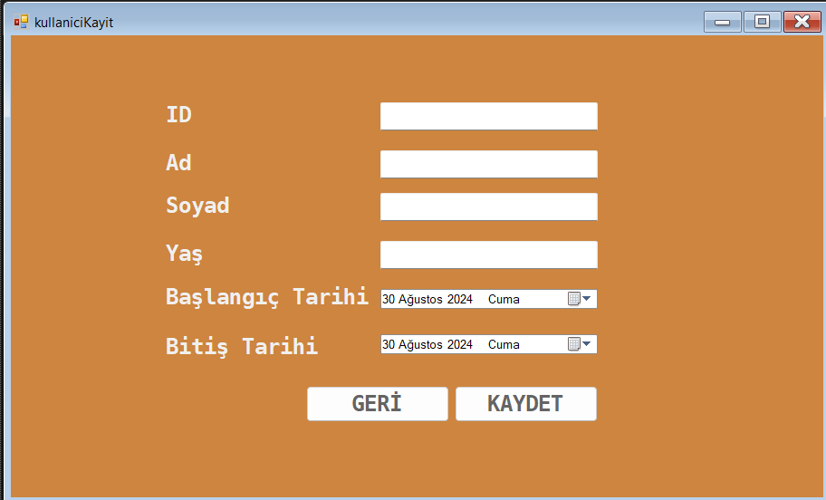

# C#
It is an RFID card reader application developed using C# that can be used in gyms.

this section is the login screen of the application.

This form shows a successful login.

This form registers a new user.

This form deletes an existing user.

Before proceeding to the update form, the ID needs to be scanned.

This is the user update form.
